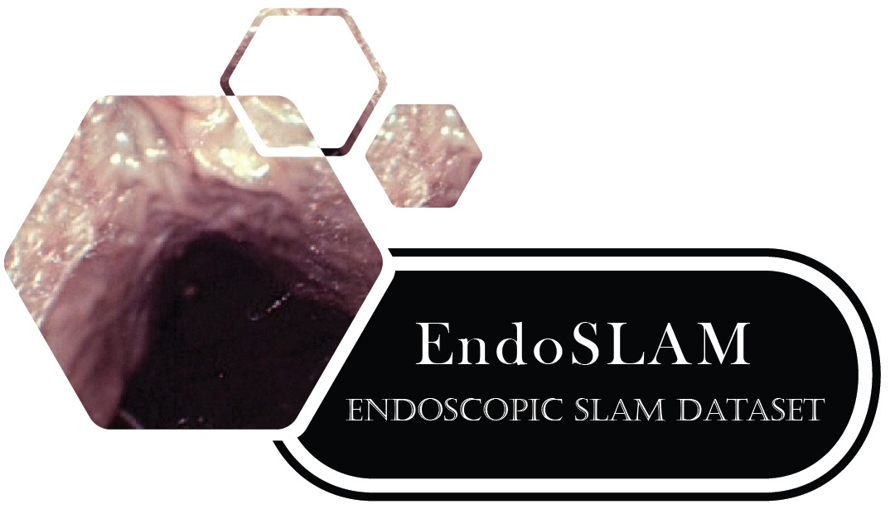
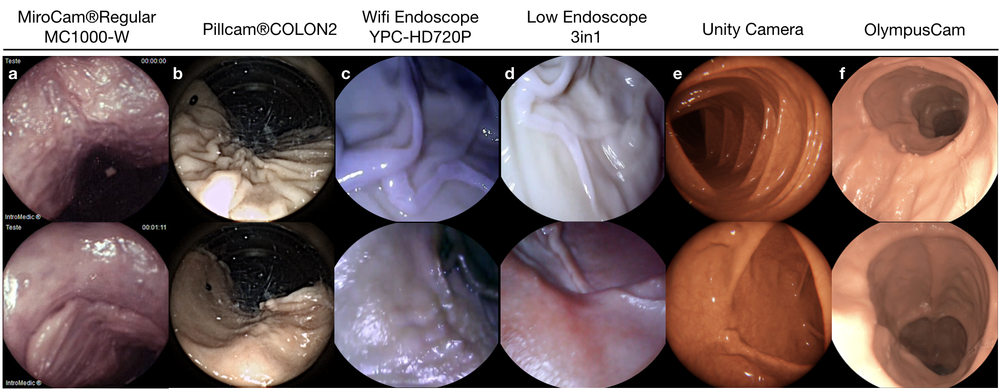
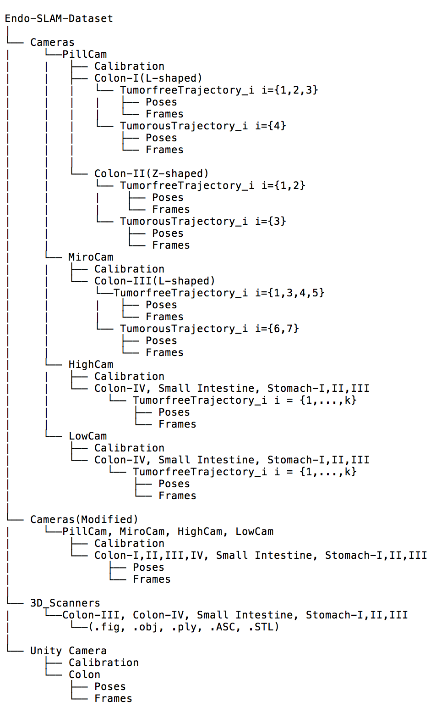
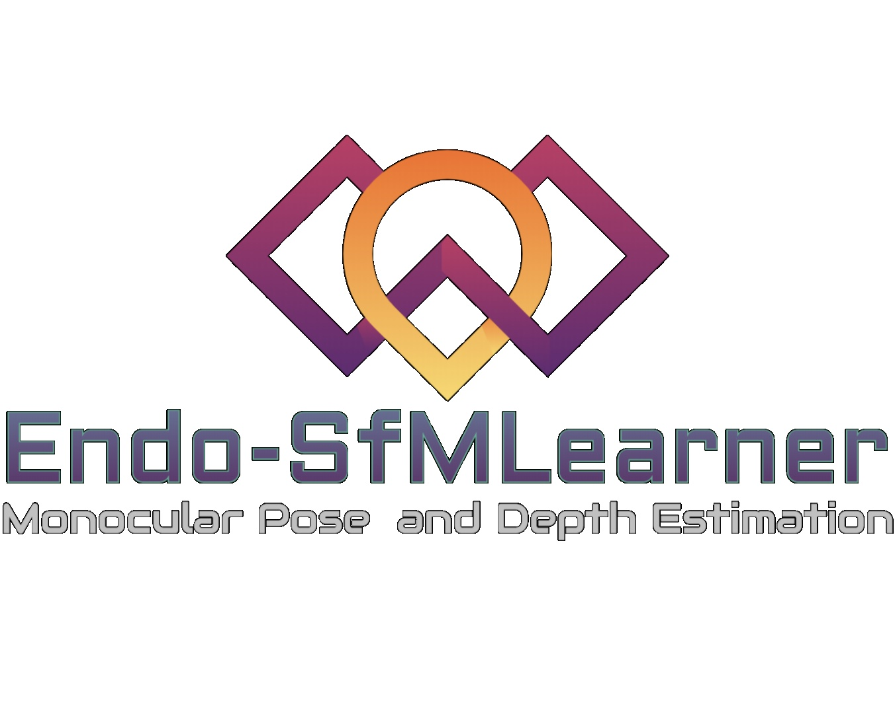
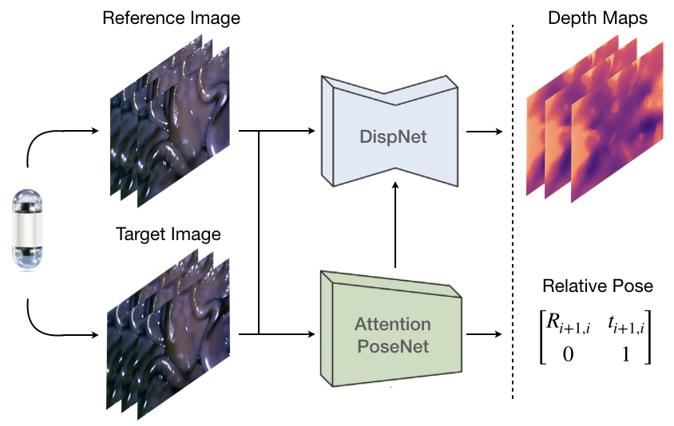
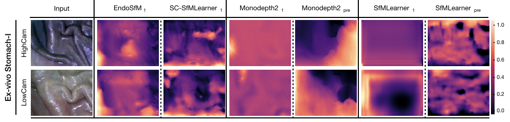
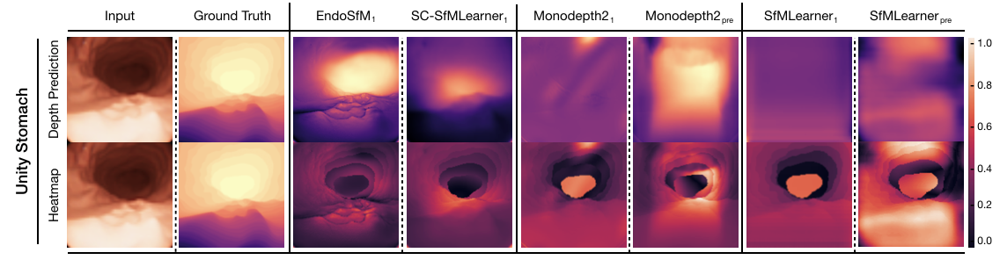
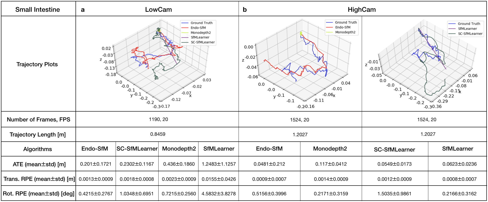
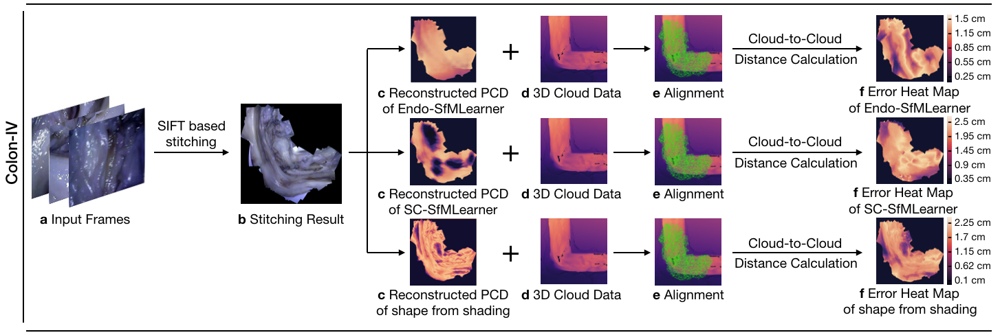

# EndoSLAM Dataset and an Unsupervised Monocular Visual Odometry and Depth Estimation Approach for Endoscopic Videos
<p align="center">
 
</p>

## EndoSLAM Dataset Overview

<p align="center">
  
</p>

We introduce an endoscopic SLAM dataset which consists of both ex-vivo and synthetically generated data. The ex-vivo part of the dataset includes  standard as well as capsule endoscopy recordings. The dataset is divided into 35 sub-datasets. Specifically, 18, 5 and 12 sub-datasets exist for colon, small intestine and stomach respectively.

 - To the best of authors' knowledge, this is the very first dataset published to be used in capsule endoscopy SLAM tasks, with timed 6 DoF pose data and high precision 3D map ground truth
  - Two different capsules and conventional endoscope cameras, with high and low resolution were used, so as to generate variety in camera specifications and lighting conditions. Images from different cameras with various resolutions for same organs and depth for each related organs are further unique features of the proposed dataset. We also provide images and pose values for two types of wireless endoscopes, which differ from each other in certain aspects like camera resolution, frame rate, and diagnostic results for detecting Z-line, duodenal papillae and bleeding.
  - Some of the sub-datasets include the same trajectories in two versions, e.g with and without polyps so that effect of having polyps as distinguishable features in the organ environment can be analysed, as well. 
  
Sample trajectories from each organ is publicly available in [Mendeley](https://data.mendeley.com/datasets/cd2rtzm23r/1).

### 1. Dataset Shooting

The experimental procedure of ex-vivo part of the dataset is demonstrated at [YouTube](https://www.youtube.com/watch?v=G_LCe0aWWdQ). To get information about generation of synthetic data, please visit [Virtaul Capsule Endoscopy](https://github.com/CapsuleEndoscope/VirtualCapsuleEndoscopy) repository.

### 2. Collection of frames taken on endoscope trajectories

Illustration of recorded frames are as following:

<p align="center">
 
</p>

The ex-vivo and synthetic parts of dataset consist of a total of 42,700 and 21,887 frames respectively. The specifications of dataset parts recorded from each camera are as follows: 

<p align="center">

|     Parts    |# of Frames | FPS  | Resolution  |
|--------------|------------|------|-------------|
| HighCam      | 21,428     | 20   |1280 x 720   | 
| LowCam       | 17,978     | 20   | 640 x 480   | 
| Pillcam      | 239        |4 - 35| 256 x 256   | 
| MiroCam      | 3,055      | 3    | 320 x 320   | 
| UnityCam     | 21,887     | 30   | 320 x 320   | 
| OlympusCam   | 12,250  | 30   | 1350 x 1080 | 
</p>
 
### 3. Dataset Organization

<p align="left">
 
</p>
<p align="center">
 
</p>


## Endo-SfMLearner Overview

We introduce Endo-SfMLearner framework as self-supervised spatial attantion-based monocular depth and pose estimation method.

Our main contributions are as follows:
- Brightness-aware photometric loss, which makes the predicted depth to be consistent under various illumination condition.
- Spatial attention based pose network which is optimized for capsule endoscopy images. 

<p align="center">
 
</p>

## Getting Started

### 1. Installation

#### Clone Endo-SfMLearner Repository

```bash
cd ~
git clone https://github.com/CapsuleEndoscope/EndoSLAM
cd EndoSLAM
```

#### Prerequisities

You will need to build the Endo-SFMLearner environment by following commend:

```bash
pip3 install -r requirements.txt
```

For the details of EndoSfM-Learner, please check the "EndoSfMLearner" folder.

### 2. Use-Cases of Endo-SfMLearner with EndoSLAM Dataset

#### 2.1 Depth Estimation

<p align="center">
 
</p>

<p align="center">
 
</p>

<p align="center">

|     Unity       |Endo-SfMLearner |Endo-SfM w/o brightness|Endo-SfM w/o attention |SC-SfMLearner| Monodepth2 | Monodepth2 pretrained | SfMLearner | SfMLearner pretrained |
|-----------------|----------------|----------------|----------------|--------------|------------|-----------------------|------------|-----------------------|
| RMSE(mean,stdev)| 0.2966 , 0.0622| 0.3288, 0.0608|0.3273, 0.1086 |0.3692 , 0.0779|0.3322 , 0.0815|0.4531 , 0.1011|0.3888 , 0.0711|0.4911 , 0.0831|


</p>

#### 2.2 Pose Estimation

  - The pose trajectories of Endo-SfMLearner and state-of-the-art methods on ex-vivo small intestine recording obtained from Low Resolution and High Resolution endoscope cameras and Mirocam capsule camera as follows:

<p align="center">
 
</p>

  - The pose trajectory on synthetic stomach data acquired in Unity environment as follows: 
 
<p align="center">
  
</p>


#### 2.3 3D Map Reconstruction

In this work, we propose and evaluate a hybrid 3D reconstruction technique. To exemplify the effectiveness of Endo-SfMLearner, we compare the results of reconstructions on Endo-SfMLearner, SC-SfMLearner and shape from shading method in terms of root mean square error(RMSE).

<p align="center">
 
</p>

 
 
|     Algorithm    | RMSE [cm] |
|--------------|------------|
| EndoSfMLearner      | 0.51     | 
| SC-SfMLearner       | 0.86   | 
| Shape from Shading      | 0.65     |

 
## Reference

If you find our work useful in your research or if you use parts of this code please consider citing our paper:

```
@misc{ozyoruk2020endoslam,
      title={EndoSLAM Dataset and An Unsupervised Monocular Visual Odometry and Depth Estimation Approach for Endoscopic Videos: Endo-SfMLearner}, 
      author={Kutsev Bengisu Ozyoruk and Guliz Irem Gokceler and Gulfize Coskun and Kagan Incetan and Yasin Almalioglu and Faisal Mahmood and Eva Curto and Luis Perdigoto and Marina Oliveira and Hasan Sahin and Helder Araujo and Henrique Alexandrino and Nicholas J. Durr and Hunter B. Gilbert and Mehmet Turan},
      year={2020},
      eprint={2006.16670},
      archivePrefix={arXiv},
      primaryClass={cs.CV}
}
```


<!-- 


## Help

- [Frequently Asked Questions](#frequently-asked-questions)
- [Limitations](#limitations)

-->
